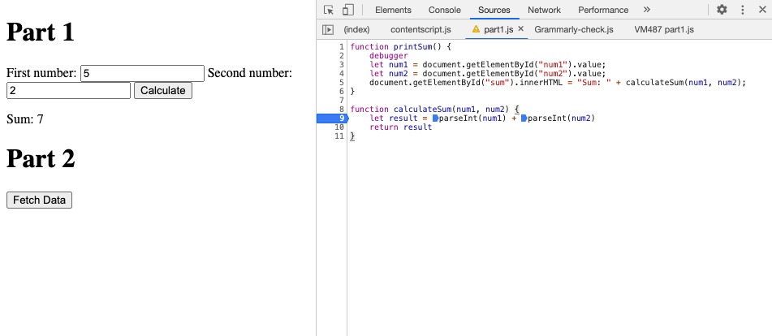

# Part 3: Debugging using the DevTools 
### DevTools: Debugging
1. there was a problem with casting the input. num1 and num2 are strings, so when result is calculated, it concatenated num1 and num2. 
2. I would convert the line 

    `let result = num1 + num2` 

    to 

    `let result = parseInt(num1) + parseInt(num2)` 

    

3. citylots.json
4. part2.js
5. 11.7mb
6. 84ms
7. Mozilla/5.0 (Macintosh; Intel Mac OS X 10_15_7) AppleWebKit/537.36 (KHTML, like Gecko) Chrome/89.0.4389.128 Safari/537.36
8. Apache
9. Tue, 26 Jan 2021 22:14:13 GMT
10. application/json
11. fetchData()